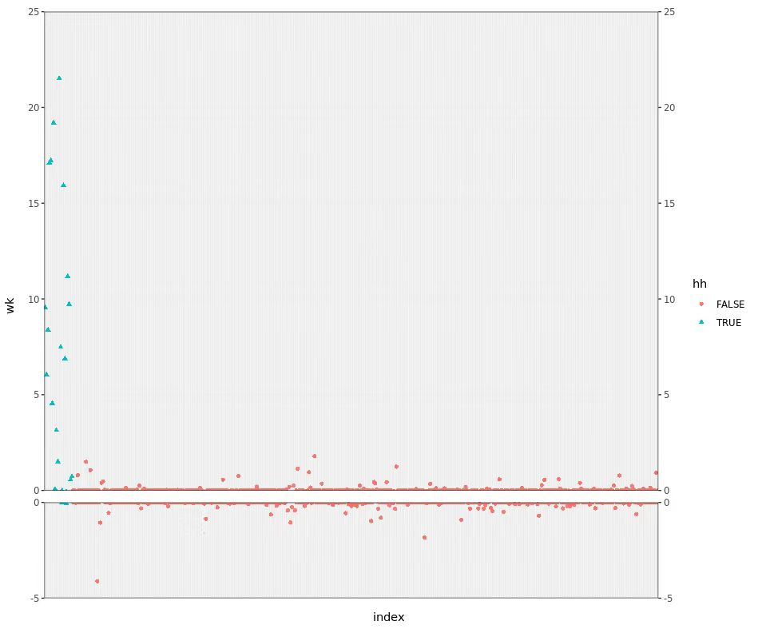
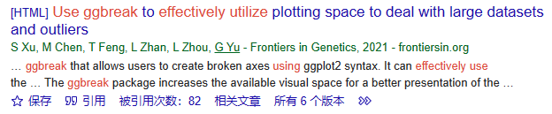
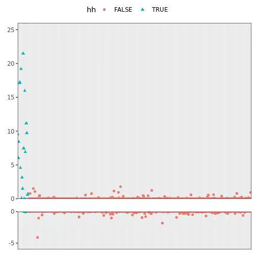

```{r setup, include=FALSE}
library(formatR)
library(extrafont)
knitr::opts_chunk$set(echo = TRUE,fig.height = 5,fig.width = 7)

# par(pin)
# fonts()
# font_import(prompt = F)
```


# 数据可视化>>基于ggplot2绘图

## 前言

### 为什么是ggplot2

### ggplot2的安装

### 关于R包开发

绘图是非常重要的一个能力，尤其是绘制某些比较特殊的图像。
在使用R的过程中，如果遇到了某些难以绘制但又比较有价值的图像，在解决该问题后，不妨把代码保存下来，或者直接做成R包。
我之前也写了一个如何开发R包的教程，可以参见
[郭老师的公众号](https://mp.weixin.qq.com/s/EOynM_XvW13k8nEkn068Vg)
或者[我的GitHub仓库](https://github.com/wangchengLi6/simpleRpackage)

这里我举一个我之前碰到的例子：当时我需要绘制一个坐标轴截断的图像，而网络上直接搜索的方法都不好用。
此时我在一篇帖子里找到了一个R包可以非常好地解决我的问题。

<center></center>

唯一的问题是，这个R包在安装后第一句话就是，如果你需要在论文中添加使用本R包绘制的图像，请引用我们的文章。
我去搜了一下才发现，作为一篇21年发表的文章，引用数当时（2023年4月）已经有了56，我昨天（9月1号）再搜了一下，已经达到了82。

<center></center>

由于我不是很想引用这篇文章，所以我自己琢磨了2个小时把图给画出来了。这是我最后绘制的图像，可以看到没有任何差别。

<center></center>

当然，下一次再碰到类似的情况，我可能就考虑直接引用而不是自己花两个小时了。

## 介绍

## ggplot2 入门

## ggplot2 与多元统计分析
